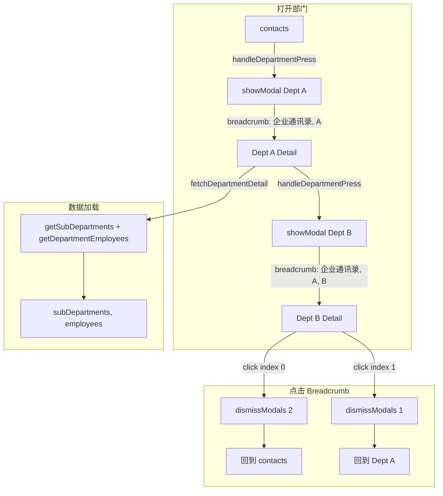

# 部门详情：接口切换与层级导航

## 1. 数据加载改造

### 1.1 新增 Remote Action

在 [app/actions/remote/contact.ts](app/actions/remote/contact.ts) 中：

- **新增** `fetchDepartmentDetail(departmentId, companyId)`，内部：
  - 调用 `ContactService.getSubDepartments(departmentId)` 获取子部门
  - 调用 `ContactService.getDepartmentEmployees(departmentId)` 获取本部门成员（替代现有的 `getDepartmentAllEmployees`）
  - 使用 `Promise.all` 并行请求，返回 `{ subDepartments, employees }`
- **调整** `fetchDepartmentEmployees`：改为调用 `ContactService.getDepartmentEmployees`（`/api/v1/departments/:id/employees`），不再用 `getDepartmentAllEmployees`。

> **说明**：`getSubDepartments` 目前用 `getCompanyDepartments('tmpteam1001')` 并按 `parent_id` 过滤。若无独立子部门接口，可在 `fetchDepartmentDetail` 中改为 `fetchCompanyDepartments(companyId)` 后按 `parent_id === departmentId` 过滤，而不改 ContactService。

### 1.2 部门详情页使用新接口

在 [app/screens/home/contacts/department_detail/index.tsx](app/screens/home/contacts/department_detail/index.tsx)：

- 将 `useEffect` 中的 `Promise.all([fetchCompanyDepartments, fetchDepartmentEmployees])` 替换为 `fetchDepartmentDetail(departmentId, companyId)`
- 用返回的 `{ subDepartments, employees }` 更新状态

---

## 2. 导航条（Breadcrumb）实现

### 2.1 可点击层级

将当前 breadcrumb 改为可点击，每个层级对应一个 `TouchableOpacity`：

- **index 0（企业通讯录）**：回到根级，关闭所有部门 modal（`dismissAllModals` 或循环 `dismissModal`）
- **index i (i > 0)**：回到第 i 级部门，关闭其上所有 modal

### 2.2 关闭逻辑

- 当前层级深度：`depth = breadcrumb.length - 1`
- 点击 index `i`：需关闭的 modal 数量 `toDismiss = depth - i`
- 在 [app/screens/navigation.ts](app/screens/navigation.ts) 中新增 `dismissModals(count: number)`：
  - 若 `count <= 0` 不操作
  - 否则循环 `count` 次，每次调用 `dismissModal()`（无 componentId，依次关闭最顶层 modal）

### 2.3 传递深度

`breadcrumb` 已通过 `passProps` 传入，`depth` 可在组件内由 `breadcrumb.length - 1` 计算，无需新 prop。

---

## 3. 样式调整（参考设计图）

在 [department_detail/index.tsx](app/screens/home/contacts/department_detail/index.tsx) 的 `getStyleSheet` 中：

| 区域   | 当前                         | 目标                                                                   |
| ---- | -------------------------- | -------------------------------------------------------------------- |
| 分割线  | 全宽 `borderBottomWidth: 1`  | 使用 `insetDivider`：`marginLeft: 56`，`marginRight: 16`，`opacity: 0.04` |
| 部门图标 | `theme.centerChannelColor` | `theme.linkColor`（蓝色）                                                |
| 成员数  | 无                          | 底部居中展示「共 X 人」，新增 `memberCountFooter` 样式                              |

### 3.1 「创建人」标签

设计图中员工右侧有「创建人」。若 API 提供该字段，可在员工行右侧展示；若无，可先预留或暂时不显示。

### 3.2 布局顺序

按设计图：员工在前，子部门在后；或子部门在前、员工在后。设计图显示「邱广生」在上、「子AA」在下，建议保持子部门在前、员工在后（与现有一致）。

---

## 4. 涉及文件

- [app/actions/remote/contact.ts](app/actions/remote/contact.ts)：`fetchDepartmentDetail`、`fetchDepartmentEmployees` 改造
- [app/screens/home/contacts/department_detail/index.tsx](app/screens/home/contacts/department_detail/index.tsx)：数据加载、可点击 breadcrumb、样式
- [app/screens/navigation.ts](app/screens/navigation.ts)：`dismissModals(count)` 工具函数

---

## 5. 数据流示意

